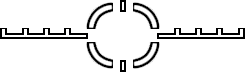
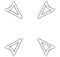
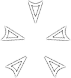
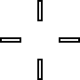
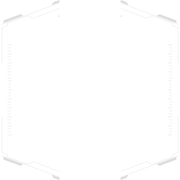
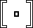

# Crosshair Modding

Example Mod:
[Custom.Crosshairs](https://github.com/MysteriousRSA/Custom.Crosshairs)

## How To Modify Crosshairs:

1: Create the following file
`~/Your.Mod/keyvalues/scripts/weapons/mp_weapon_[desired weapon].txt`

2: Put the following into the newly created .txt file:

```
WeaponData
{
    RUI_CrosshairData
    {
        Crosshair_1
        {
            "ui"                        "ui/crosshair_alternator"
        }
    }
}
```

3: Change `"ui/crosshair_alternator"` to your desired crosshair.

## Overlapping Crosshairs

It is possible to combine crosshairs by modifying the `mp_weapon_[Desired
Weapons].txt` file.

**Below is an example of combining the Alternator and R201 crosshairs
into one.**

```
WeaponData
{
    "active_crosshair_count"            "2" //Amount of crosshairs you want to use

    RUI_CrosshairData
    {
        Crosshair_1
        {
            "ui"                        "ui/crosshair_alternator"
        }
        Crosshair_2
        {
            "ui"                        "ui/crosshair_tri"
        }
    }
}
```

**To add more crosshairs add another Crosshair\_X following the
formating in the script above.**

!!! note
    The limit for this seems to be 4 Crosshairs on-screen at once.

## How the script above appears:


## Adjust Crosshair Spread?

Simply add the following line below the "ui" line: `"base_spread"               "3.0"`

```
WeaponData
{
    RUI_CrosshairData
    {
        Crosshair_1
        {
            "ui"                        "ui/crosshair_alternator" //This is the Croshair
            "base_spread"               "3.0"   //This is a spread Multiplier, line doesn't exist by default
        }
    }
}
```

* This only affects the visual spread of the crosshair, not the actual bullet spread. Positive values increase the spread while negative values decrease it. By default, it is based on the weapon's own stats.

## No Crosshair?

```
WeaponData
{
    RUI_CrosshairData
    {
        Crosshair_1
        {
            "ui"                        "ui/crosshair_sniper_amped" //This means NO crosshair, unless your weapon is amped
        }
    }
}
```

## Crosshair Index:

These are the available crosshairs in-game, along with their in-game
reference:

### Titan Crosshairs:

| Picture | Value | Special Properties |
| ------- | ----- | ------- ---------- |
| | `ui/crosshair_40mm` | `NOADS` |
| | `ui/crosshair_40mm_burst` | `NOADS`, `TRACKER` |
| | `ui/crosshair_flight_core` | `NOADS`, `NOSPREAD` |
| | `ui/crosshair_heat_shield` / `ui/crosshair_vortex` | `NOADS`, `NOSPREAD`, `TRACKER` |
| | `ui/crosshair_ion` | `NOADS` |
| | `ui/crosshair_leadwall` | `NOADS`,` NOSPREAD` |
| | `ui/crosshair_quad_rocket` | `NOADS`,` NOSPREAD` |
| | `ui/crosshair_scorch` ||
| | `ui/crosshair_titan_predator_close_range`/ `ui/crosshair_titan_predator_power_shot_close` | `NOADS` |
| | `ui/crosshair_titan_predator_power_shot_long` | `NOADS` |
| | `ui/crosshair_titan_sniper` | `NOADS`, `NOSPREAD`, `TRACKER` |
| | `ui/crosshair_tracker_rockets` | `NOADS`, `NOSPREAD` |

### Pilot Crosshairs:
| Picture | Value | Special Properties |
| ------- | ----- | ------- ---------- |
| | `ui/crosshair_alternator` ||
| | `ui/crosshair_arc` | `NOADS`, `NOSPREAD` |
| | `ui/crosshair_circle` / `ui/crosshair_circle2` / `ui/crosshair_circle2_small` | `NOADS`, `NOSPREAD` |
| | `ui/crosshair_charge_rifle` | `NOADS`, `NOSPREAD, TRACKER` |
| | `ui/crosshair_dot` / `ui/crosshair_wingman_n` ||
| | `ui/crosshair_esmoke` | `NOADS`, `NOSPREAD` |
| | `ui/crosshair_firestar` | `NOADS`, `NOSPREAD` |
| | `ui/crosshair_frag` / `ui/crosshair_frag2` | `NOADS`, `NOSPREAD` |
| | `ui/crosshair_grapple` | `NOADS`, `NOSPREAD`, `TRACKER` |
| | `ui/crosshair_grapple_charge` / `ui/crosshair_phase_charge` | `NOADS`, `NOSPREAD`, `TRACKER` |
| | `ui/crosshair_gravstar` | `NOADS`, `NOSPREAD` |
| | `ui/crosshair_grenade_launcher` / `ui/crosshair_grenade_launcher2` | `NOADS` |
| | `ui/crosshair_ladder` | `NOADS`, `NOSPREAD` |
| | `ui/crosshair_lstar` / `ui/crosshair_shotgun` ||
| | `ui/crosshair_mastiff` | `NOSPREAD` |
| | `ui/crosshair_mine` | `NOADS`, `NOSPREAD` |
| | `ui/crosshair_mozambique` | `NOSPREAD` |
| | `ui/crosshair_plus` ||
| | `ui/crosshair_pulse_blade` | `NOADS`, `NOSPREAD` |
| | `ui/crosshair_satchel` | `NOADS`, `NOSPREAD` |
| | `ui/crosshair_smart_pistol` | `NOADS`, `NOSPREAD`, `TRACKER` |
| | `ui/crosshair_smr` | `NOADS`, `NOSPREAD` |
| | `ui/crosshair_sniper_amped` | `AMPED`, `NOSPREAD` |
| | `ui/crosshair_square` ||
| | `ui/crosshair_test` ||
| | `ui/crosshair_tri` ||
| | `ui/crosshair_turret` | `NOADS`, `TRACKER` |
| | `ui/crosshair_wingman` ||

!!! note
    ``ui/crosshair_test`` has a rapidly flashing dot in its center.

!!! note
    Some of the crosshairs shown above were recreated from scratch, and may not be entirely accurate to their in-game look.

* `AMPED` means the crosshair is invisible, unless your weapon is amped.
* `NOADS` means the crosshair doesn't fully disappear when aiming down sights.
* `NOSPREAD` means the crosshair completely ignores the `"base_spread"` setting, and will always use a specific spread.
* `TRACKER` means the crosshair can track a specific value of your weapon (charge amount, clip size...).

## Examples


### Extra Info


* As with any mod, it is recommended to test this out in a private match first. Save any changes you made to the desired weapon's file and type `sv_cheats 1; reload_mods; weapon_reparse; sv_cheats 0` in your console.


* Keep in mind that some weapons have animated or dynamic crosshairs. Weapons like the Charge Rifle, Cold War, Frag Grenade, etc... have custom animations for their crosshairs. Which can cause weirdness or jank when used on other weapons or when using other crosshairs on them.
   * Animated weapons like the Charge Rifle will work with animated crosshairs like `ui/crosshair_titan_sniper`

Thank you to `Cpone#0001` and `Nixie#8251` from the [Northstar
Discord](https://northstar.tf/discord) for helping me figure this out.
