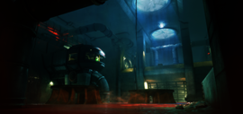
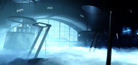
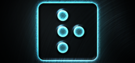

# Atlas

TODO

## Main menu promos

For defining main menu promos shown to players, Atlas sends a JSON that defines them.

The endpoint for this is `/client/mainmenupromos`

```json
{
    "newInfo": {
        "Title1": "%$rui\/bullet_point%`2Northstar vX.Y`0 is now live!",
        "Title2": "%$rui\/bullet_point%`2Highlighted`0 defailt",
        "Title3": "%$rui\/bullet_point%Make sure to `2update`0 your game!"
    },
    "largeButton": {
        "Title": "Blog Title",
        "Text": "Short Summary",
        "Url": "https://northstar.tf/blog/REPLACE-ME/",
        "ImageIndex": 0
    },
    "smallButton1": {
        "Title": "Join the Discord!",
        "Url": "https://northstar.tf/discord",
        "ImageIndex": 22
    },
    "smallButton2": {
        "Title": "Check out the Northstar Wiki!",
        "Url": "https://northstar.tf/wiki",
        "ImageIndex": 12
    }
}
```

`ImageIndex` corresponds to the index of the corresponding spotlight + 1

### Spotlights

The spotlights are:

| Name           | Image                                                                |
| -------------- | -------------------------------------------------------------------- |
| `spotlight_01` |  |
| `spotlight_02` |  |
| `spotlight_03` |  |
| `spotlight_04` |  |
| `spotlight_05` |  |
| `spotlight_06` |  |
| `spotlight_07` |  |
| `spotlight_08` |  |
| `spotlight_09` |  |
| `spotlight_10` |  |
| `spotlight_11` |  |
| `spotlight_12` |  |
| `spotlight_13` |  |
| `spotlight_14` |  |
| `spotlight_15` |  |
| `spotlight_16` |  |
| `spotlight_17` |  |
| `spotlight_18` |  |
| `spotlight_19` |  |
| `spotlight_21` |  |
| `spotlight_22` |  |
| `spotlight_23` |  |
| `spotlight_24` |  |
| `spotlight_25` |  |
| `spotlight_26` |  |

!!! note
    These images are lower scaled version of the originals.
    For the high quality original images, check the game files.

!!! note
    `spotlight_20` does not seem to exist